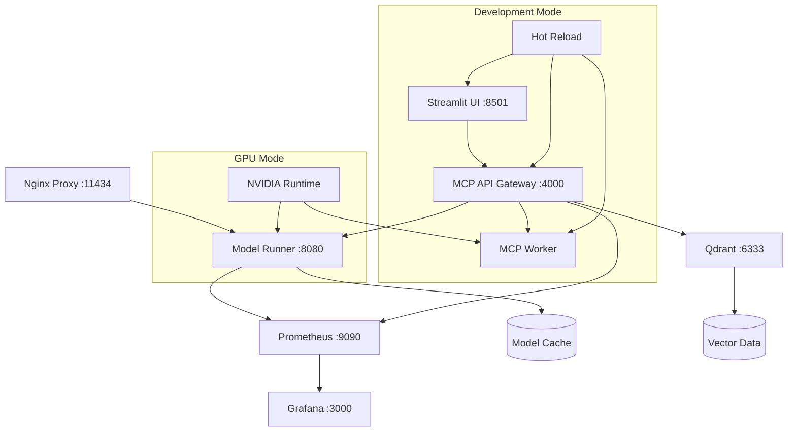

# Docker MCP Stack v2.0

> **Cross-platform GenAI development environment with modular services, GPU acceleration, and Windows/WSL2/Linux compatibility**

[](https://docs.docker.com/compose/)
[](https://github.com/docker/model-runner)
[](https://github.com/microsoft/mcp)
[](https://github.com/yourusername/docker-mcp-stack)

## 🌟 What's New in v2.0

- **🏗️ Modular Architecture**: Clean separation of concerns with dedicated services
- **🚀 Unified Model Runner**: Single API for all LLMs using Docker Model Runner
- **🖥️ Cross-Platform**: Full Windows (WSL2), Linux, and macOS support
- **⚡ GPU Acceleration**: NVIDIA Container Toolkit integration
- **🔄 Hot Reload**: Development mode with instant code updates
- **📊 Modern UI**: Beautiful Streamlit interface with real-time monitoring
- **🐳 Model Distribution**: Docker-native model management via OCI artifacts

## 🏠 Architecture Overview



## 🚀 Quick Start

### Prerequisites

- **Docker** & **Docker Compose** v2.0+
- **8GB+ RAM** (more for multiple models)
- **GPU** with CUDA support (optional but recommended)

### 🐧 Linux (CPU Mode)

```bash
git clone https://github.com/yourusername/docker-mcp-stack.git
cd docker-mcp-stack
make cpu
```

### 🎮 Linux (GPU Mode)

```bash
# Install NVIDIA Container Toolkit
make setup-linux

# Start with GPU acceleration
make gpu
```

### 🪟 Windows (WSL2)

```bash
# 1. Install Ollama on Windows
# Download from https://ollama.ai/

# 2. Start Ollama service
ollama serve

# 3. Start MCP Stack (points to host Ollama)
make windows
```

### 🍎 macOS

```bash
# 1. Install Ollama
brew install ollama

# 2. Start Ollama service  
ollama serve

# 3. Start MCP Stack
make windows  # Uses same config as Windows
```

## 🎛️ Available Commands

### Core Operations

- `make up` - Start the stack (CPU mode)
- `make gpu` - Start with GPU acceleration
- `make dev` - Development mode with hot-reload
- `make windows` - Windows/macOS mode (uses host Ollama)
- `make down` - Stop all services
- `make logs` - View service logs

### Model Management

- `make pull-model MODEL=llama3:8b` - Pull a model
- `make list-models` - List available models
- `make push-model MODEL=llama3:8b` - Push model to registry
- `make rm-model MODEL=llama3:8b` - Remove a model

### Development

- `make build` - Build all services
- `make test` - Run tests
- `make lint` - Check code quality
- `make format` - Format code

### Monitoring

- `make status` - Service status
- `make health` - Health checks
- `make monitoring` - Start Prometheus + Grafana

### Backup & Restore

- `make backup` - Backup data volumes
- `make restore BACKUP=filename.tar.gz` - Restore from backup

## 🌐 Service Endpoints

| Service | URL | Description |
|---------|-----|-------------|
| **Streamlit UI** | <http://localhost:8501> | Modern chat interface |
| **MCP API** | <http://localhost:4000> | REST API gateway |
| **Model Runner** | <http://localhost:8080> | Unified LLM API |
| **Qdrant** | <http://localhost:6333> | Vector database |
| **Prometheus** | <http://localhost:9090> | Metrics collection |
| **Grafana** | <http://localhost:3000> | Monitoring dashboards |
| **Nginx Proxy** | <http://localhost:11434> | OpenAI-compatible proxy |

## 🏗️ Service Architecture

### Core Services

#### 🤖 Model Runner

- **Purpose**: Unified LLM inference API
- **Technology**: Docker Model Runner + llama.cpp
- **Features**: OpenAI-compatible API, GPU acceleration, metrics
- **Port**: 8080

#### 🌐 MCP API Gateway

- **Purpose**: Central API for MCP protocol handling
- **Technology**: FastAPI + Python
- **Features**: Request routing, authentication, monitoring
- **Port**: 4000

#### 🗄️ Vector Database (Qdrant)

- **Purpose**: Vector storage for embeddings and RAG
- **Technology**: Qdrant
- **Features**: High-performance vector search, REST API
- **Port**: 6333

#### 👷 MCP Worker

- **Purpose**: Background processing (embeddings, async tasks)
- **Technology**: Celery + Python
- **Features**: Distributed processing, GPU acceleration

#### 🖥️ Streamlit UI

- **Purpose**: Modern web interface
- **Technology**: Streamlit + Python
- **Features**: Real-time chat, model selection, monitoring
- **Port**: 8501

### Supporting Services

#### 🔄 Nginx Proxy

- **Purpose**: Reverse proxy and load balancer
- **Features**: SSL termination, rate limiting, OpenAI compatibility

#### 📊 Monitoring Stack

- **Prometheus**: Metrics collection
- **Grafana**: Visualization and dashboards

## 🔧 Configuration

### Environment Variables

Key configurations in `.env`:

```bash
# Platform Configuration
ENVIRONMENT=development
OLLAMA_BASE_URL=http://model-runner:8080/v1  # Linux
# OLLAMA_BASE_URL=http://host.docker.internal:11434/v1  # Windows/Mac

# GPU Configuration  
CUDA_VISIBLE_DEVICES=0
LLAMA_SERVER_VARIANT=cuda  # or 'cpu'

# Resource Limits
MODEL_MEMORY_LIMIT=4g
MODEL_CPU_LIMIT=2

# Ports
MODEL_RUNNER_PORT=8080
MCP_API_PORT=4000
UI_PORT=8501
```

### Docker Compose Profiles

The stack uses profiles for different deployment scenarios:

- **`cpu`**: CPU-only inference
- **`gpu`**: GPU-accelerated inference  
- **`dev`**: Development with hot-reload
- **`ui`**: UI services only
- **`monitoring`**: Prometheus + Grafana
- **`core`**: Essential services only

## 🔄 Model Lifecycle

### Using Docker Model CLI (Docker Desktop 4.24+)

```bash
# Pull models from registries
docker model pull docker.llama3:8b

# List available models
docker model ls

# Remove models
docker model rm docker.llama3:8b

# Push custom models
docker model push my-registry.com/my-model:latest
```

### Manual Model Management

```bash
# Download models to cache
docker run --rm -v models_cache:/models alpine wget -O /models/llama3.gguf https://example.com/llama3.gguf

# List cached models
docker run --rm -v models_cache:/models alpine ls -la /models/
```

## 🧪 Development Workflow

### 1. Development Setup

```bash
# Start development environment
make dev

# Open in VS Code with devcontainer
code .
# Select "Reopen in Container" when prompted
```

### 2. Code Hot-Reload

The development mode mounts source code with hot-reload:

- **MCP API**: FastAPI auto-reload on Python changes
- **UI**: Streamlit file watcher for instant updates  
- **Worker**: Automatic process restart on code changes

### 3. Testing

```bash
# Run all tests
make test

# Run specific service tests
docker compose exec mcp-api python -m pytest tests/

# Integration tests
curl http://localhost:4000/health
curl http://localhost:8080/v1/models
```

## 🌍 Cross-Platform Support

### Linux

- ✅ Native Docker support
- ✅ Full GPU acceleration
- ✅ All features available

### Windows (WSL2)

- ✅ Docker Desktop integration
- ✅ GPU support via WSL2
- ⚠️ Use host Ollama for better performance
- 💡 Keep code in WSL2 filesystem for speed

### macOS

- ✅ Docker Desktop support
- ⚠️ GPU support limited
- ⚠️ Use host Ollama
- 💡 Consider CPU-only models

## 📊 Monitoring & Observability

### Built-in Metrics

- **Model Runner**: Request rates, latency, GPU utilization
- **MCP API**: API response times, error rates
- **System**: Memory, CPU, disk usage

### Grafana Dashboards

Pre-configured dashboards for:

- LLM Performance Metrics
- System Resource Usage  
- API Request Analytics
- Vector Database Performance

### Logging

Structured JSON logging with:

- Request tracing
- Error tracking
- Performance metrics
- Security audit logs

## 🔒 Security Considerations

### Production Checklist

- [ ] Change default passwords
- [ ] Generate secure JWT secrets
- [ ] Enable SSL/TLS certificates
- [ ] Configure firewall rules
- [ ] Set up log rotation
- [ ] Enable authentication
- [ ] Review exposed ports

### Security Features

- Container isolation
- Non-root user execution
- Secret management via Docker secrets
- Network segmentation
- Resource limits

## 🗄️ Backup & Recovery

### Automated Backups

```bash
# Create backup
make backup

# Restore from backup
make restore BACKUP=qdrant-20241222-120000.tar.gz

# List available backups
ls -la backups/
```

### What Gets Backed Up

- **Qdrant data**: Vector embeddings and collections
- **Model cache**: Downloaded model files
- **Configuration**: Service configurations
- **User data**: Application data and settings

## 🚀 Deployment

### Docker Swarm

```bash
# Convert to swarm stack
docker swarm init
docker stack deploy -c compose/docker-compose.base.yml mcp-stack
```

### Kubernetes

```bash
# Generate Kubernetes manifests (using kompose)
kompose convert -f compose/docker-compose.base.yml
kubectl apply -f .
```

### Cloud Deployment

The stack works on:

- **AWS**: ECS, EKS, EC2
- **Azure**: Container Instances, AKS  
- **GCP**: Cloud Run, GKE
- **DigitalOcean**: App Platform, Kubernetes

## 🤝 Contributing

We welcome contributions! Please see [CONTRIBUTING.md](CONTRIBUTING.md) for guidelines.

### Development Setup

1. Fork the repository
2. Clone your fork
3. Open in VS Code devcontainer
4. Make changes and test
5. Submit a pull request

## 📚 Documentation

- [Architecture Decision Records](docs/adr/)
- [API Documentation](docs/api-reference.md)
- [Model Management](docs/model-management.md)
- [Deployment Guide](docs/deployment.md)
- [Troubleshooting](docs/troubleshooting.md)

## 🐛 Troubleshooting

### Common Issues

#### Services won't start

```bash
# Check Docker daemon
docker info

# Check service logs
make logs

# Check service health
make health
```

#### Model loading fails

```bash
# Check model cache
docker volume inspect docker-mcp-stack_models_cache

# Verify model files
docker run --rm -v models_cache:/models alpine ls -la /models/
```

#### GPU not detected

```bash
# Test GPU access
docker run --rm --gpus all nvidia/cuda:11.5.2-base-ubuntu20.04 nvidia-smi

# Check NVIDIA Container Toolkit
sudo nvidia-ctk runtime configure --runtime=docker
```

### Performance Optimization

- **WSL2**: Keep code in Linux filesystem
- **Memory**: Adjust `MODEL_MEMORY_LIMIT` based on available RAM
- **GPU**: Use appropriate `CUDA_VISIBLE_DEVICES` setting
- **Storage**: Use SSD for model cache and data volumes

## 📄 License

This project is licensed under the MIT License - see the [LICENSE](LICENSE) file for details.

## 🙏 Acknowledgments

Built with inspiration from:

- [Docker GenAI Stack](https://github.com/docker/genai-stack)
- [Docker Model Runner](https://github.com/docker/model-runner)
- [Ollama Docker](https://github.com/mythrantic/ollama-docker)
- [Model Context Protocol](https://github.com/microsoft/mcp)

---

<p align="center">
  <strong>🚀 Ready to build the future of AI development? Start now!</strong><br>
  <code>git clone https://github.com/yourusername/docker-mcp-stack.git && cd docker-mcp-stack && make up</code>
</p>
